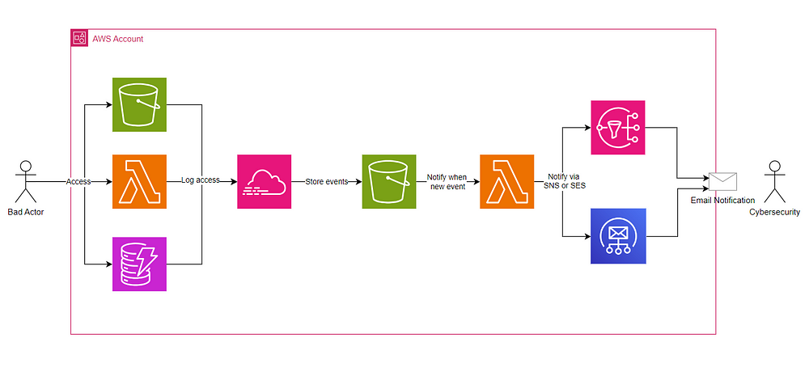

# HoneyTrail
<p align="center">
  
</p>
Independently deploy customized honeyservices in AWS to trigger alerts on unauthorized access. It utilizes a dedicated CloudTrail for precise detection and notification specifically for honeyservices activity. 

## Configuration Details

Before deploying HoneyTrail, you must configure the tool according to your specific needs. Below is an example of the shared.auto.tfvars.json.example file included in this repository:

``` 
{
    "enable_s3_event_selector": true,
    "enable_dynamodb_event_selector": false,
    "enable_lambda_event_selector": false,
    "enable_sns": true,
    "destination_email": "example@example.com",
    "source_email": "",
    "vpnapi_key": "",
    "ses_identity": [""]
}
```
### Configuration Options

**enable_s3_event_selector:** Set to true to deploy an S3 bucket as a deception service.
**enable_dynamodb_event_selector:** Set to true to deploy a DynamoDB table as a deception service.
**enable_lambda_event_selector:** Set to true to deploy a Lambda function as a deception service.
**enable_sns:** If true, alerts are sent via AWS SNS. This requires no other AWS service.
**destination_email:** Mandatory. The email address where alerts will be sent.
**source_email:** Required if using SES (SNS disabled) for notifications.
**vpnapi_key:** Optional. If using SES (SNS disabled), you can specify a vpnapi.io key to include IP address information in the notifications.
**ses_identities:** Required if using SES (SNS disabled), these are the identities the lambda will use to send the email. 

## Deployment Instructions

- **Clone the Repository:** Start by cloning this repository to your local machine or cloud environment.
- **Review and Modify Configuration:** Create a shared.auto.tfvars.json file using the example, and adjust the settings according to your preferences. Ensure the destination_email is correctly set to receive alerts.
- **Customize Deception Services:** To increase the effectiveness of the deception, you are encouraged to modify the names and data of the services in the honeytoken-dynamodb.tf, honeytoken-lambda.tf, and honeytoken-s3.tf files. Personalizing these details makes the deception more convincing.
- **Initialize Terraform:** Run ``terraform init`` to initialize the Terraform configuration.
- **Apply Terraform Configuration:** Execute ``terraform apply`` to deploy the HoneyTrail services to your AWS environment.
- (Only for SNS) After the terraform apply, the destination_email will receive an email to subscribe to the SNS topic. Confirm the subscription to start receiving alerts.

## How HoneyTrail Works
HoneyTrail includes a few components designed to detect attackers:

- **S3 Bucket:** It is an S3 bucket that contains an object called 'users_data.csv' full of fake data.
- **Lambda:** A Go Lambda function named "GetAccessKeyForBackups", that doesn't show its code in the AWS console (because it is in Go), tempting attackers trying to find a backdoor access to invoke it.
- **DynamoDB:** A DynamoDB table called 'CreditCardData'.

A CloudTrail monitors these services using an advanced event selector that focuses exclusively on specific activities such as accessing the S3 file, invoking the Lambda function, or querying the DynamoDB table. When an attacker interacts with any of these services, a CloudTrail log is generated and stored in an S3 bucket configured with Event Notifications. This feature triggers a Lambda function that is set up to alert you via Simple Notification Service (SNS) or Simple Email Service (SES), depending on the chosen configuration.

<p align="center">
  
</p>

## Usage and Alerts

When an attacker interacts with any of the deployed services, a CloudTrail log is created and an alert is triggered.
Alerts will be sent to the destination_email via SNS or SES, depending on your configuration.

**Using SNS:** This method sends alerts directly to an email without needing any extra setup.
**Using SES:** If you choose SES, you can get more detailed notifications. Plus, if you use a free API key from vpnapi.io, the notifications will also include additional information about the IP address of the requester. However, this setup requires a previously configured SES identity.
